# どくしょ ちょきんばこ の つかいかた

このページは、よんだ本を バーコードで きろくして、さつ<ruby>数<rt>すう</rt></ruby>・ページ<ruby>数<rt>すう</rt></ruby>・きんがくを ためていく アプリ「どくしょ ちょきんばこ」の つかいかたです。はじめて ひらく人が、この ページだけで さいごまで つかえるように、がめんの しゃしんと 見くらべながら 上から じゅんに よんで ください。

## どくしょ ちょきんばこで できること

この しょうでは、この アプリが <ruby>何<rt>なに</rt></ruby>を する ものか、だれが つかう ものか、つかう まえに <ruby>用意<rt>ようい</rt></ruby>する ものを せつめいします。

### どんな アプリか

よんだ本の うらに ある バーコードを カメラで よむと、本の なまえ・かいた人・ページ<ruby>数<rt>すう</rt></ruby>・ねだんが じどうで 入ります。それを 1さつずつ きろくして いくと、よんだ本の かず・ページ<ruby>数<rt>すう</rt></ruby>・きんがくが「ちょきん」のように たまって いきます。

つかうのは 小学校の 子どもです。1年生から 6年生まで つかえます。先生や おうちの人は、さいしょに アプリを 入れる ときと、きろくを <ruby>紙<rt>かみ</rt></ruby>に いんさつする ときに 手つだって ください。

できる ことは 大きく わけて 6つ あります。

- 本を きろくする（カメラ・ばんごう・じぶんで かく の 3つの やりかた）
- よんだ本の リストを 見る・さがす
- ほしと かんそうを つける
- 月の もくひょうと スタンプちょう
- どくしょの ふりかえりを グラフで 見る
- きろくを ファイルに のこす・<ruby>紙<rt>かみ</rt></ruby>に いんさつする

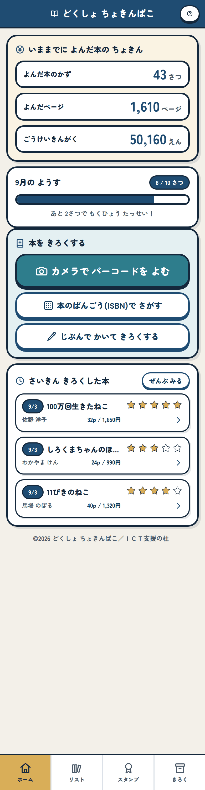

ホームがめんです。上から ちょきん・こんげつの ようす・きろくの ボタンと つづきます。

### つかう まえに <ruby>用意<rt>ようい</rt></ruby>する もの

つぎの 3つを <ruby>用意<rt>ようい</rt></ruby>して ください。

- カメラの ついた タブレット、スマートフォン、または パソコン。カメラが なくても、ばんごうを 入れたり じぶんで かいたり して きろくできます
- ブラウザ（Chrome、Edge、Safari の どれか）
- アプリの アドレス https://reading-books.giga-school.com/

なまえや パスワードは いりません。アカウントを つくる ことも ありません。

インターネットは、さいしょに ひらく ときと、本の じょうほうを しらべる ときだけ つかいます。それ いがいは つながって いなくても つかえます。

### きろくは どこに のこるか（インターネットには おくらない）

よんだ本の きろくは、つかって いる きかいの 中だけに のこります。インターネットへ おくる ことは ありません。なまえや クラスを 入れる ところも ありません。

だから、べつの きかいで ひらいても きろくは 出て きません。きかいを かえる ときは「データを のこす・よみこむ」の しょうを 見て ください。

## はじめて ひらく ときに する こと（さいしょの 1<ruby>回<rt>かい</rt></ruby>だけ）

さいしょの 1<ruby>回<rt>かい</rt></ruby>だけ やって おく ことが 2つ あります。1つめは かならず やります。2つめは やらなくても つかえますが、やって おくと べんりです。

### ブラウザで アドレスを ひらく

ブラウザを ひらいて、いちばん 上の アドレスの ところに つぎの ように 入れて ください。

https://reading-books.giga-school.com/

すぐに ホームがめんが 出ます。まだ <ruby>何<rt>なに</rt></ruby>も きろくして いない ときは「まだ きろくが ありません」と 出ます。これで ただしく ひらけて います。

さいしょの 1<ruby>回<rt>かい</rt></ruby>は、かならず インターネットに つながった ところで ひらいて ください。その ときに アプリの 中みが きかいの 中に 入ります。2<ruby>回<rt>かい</rt></ruby>めからは、つながって いなくても ひらけます。

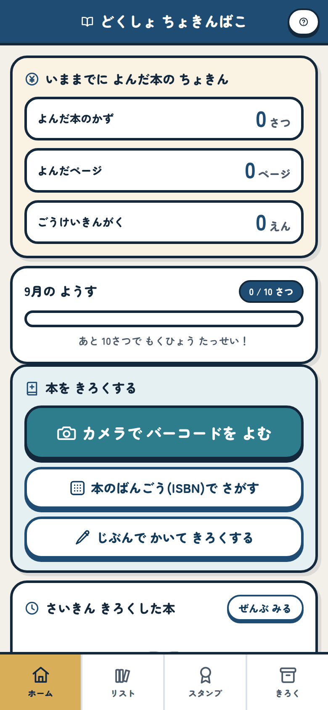

まだ 1さつも ないので、ぜんぶ 0 に なって います。

### ホームがめんに アプリとして 入れて おく（先生に 手つだって もらう）

ホームがめんに 入れて おくと、ブラウザの バーが きえて がめんが ひろく なり、アイコンを 1<ruby>回<rt>かい</rt></ruby> おすだけで ひらけます。iPad では、きろくが きえにくく なる よい ことも あります。

入れかたは きかいに よって ちがいます。

Chromebook・Windows・Android（Chrome / Edge）の 手じゅん:

1. 下の「きろく」を おします。
2. 「アプリとして インストール」を おします。
3. ブラウザが 出す かくにんの がめんで「インストール」を おします。

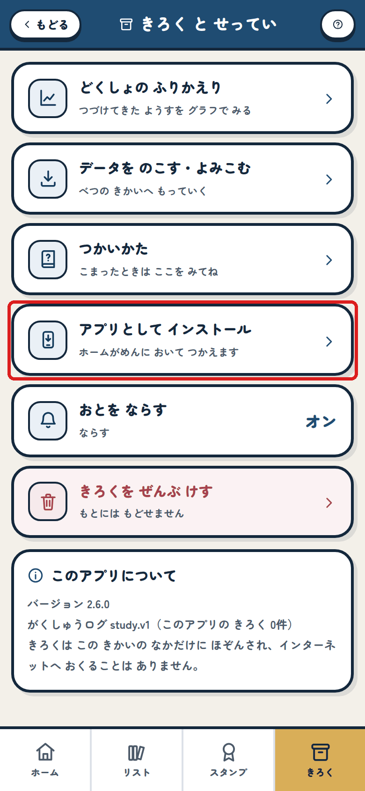

赤い わくの <ruby>行<rt>ぎょう</rt></ruby>を おします。

「アプリとして インストール」の <ruby>行<rt>ぎょう</rt></ruby>が 見あたらない ときは、ブラウザが「入れられます」と おしえて きて いない ときです。ブラウザの 右上の <ruby>点<rt>てん</rt></ruby>が 3つ ならんだ ボタンを おして、「アプリをインストール」か「ホーム<ruby>画面<rt>がめん</rt></ruby>に<ruby>追加<rt>ついか</rt></ruby>」を えらんで ください。

iPad・iPhone（Safari）の 手じゅん:

1. 下の「きろく」を おします。
2. 「アプリとして インストール」を おします。やりかたの あんないが 出ます。
3. Safari の 下（iPad では 右上）に ある <ruby>共有<rt>きょうゆう</rt></ruby>の ボタン（<ruby>四角<rt>しかく</rt></ruby>から 上へ <ruby>矢<rt>や</rt></ruby>じるしが 出て いる しるし）を おします。
4. 下の ほうに ある「ホーム<ruby>画面<rt>がめん</rt></ruby>に<ruby>追加<rt>ついか</rt></ruby>」を おします。
5. 右上の「<ruby>追加<rt>ついか</rt></ruby>」を おします。

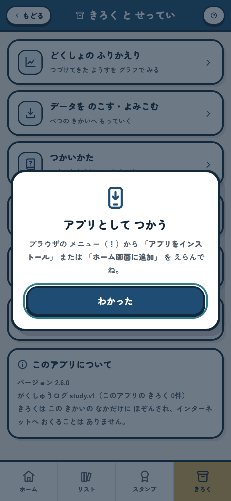

「アプリとして インストール」を おすと 出る あんないです。

【！】おぼえて おいて ほしい こと:

- 入れなくても、ブラウザの ままで ぜんぶの きのうが つかえます。
- iPad の Safari は、7日 いじょう 1<ruby>回<rt>かい</rt></ruby>も ひらかないと のこした きろくが きえる ことが あります。ホームがめんに 入れて おくと おきにくく なります。
- ホームがめんに 入れても、きろくは その きかいの 中に のこった ままです。べつの きかいには うつりません。

## ホームがめんの みかた

ホームがめんには、上の おび・ちょきん・こんげつの ようす・きろくの ボタン・さいきんの 本・下の タブが あります。どこに <ruby>何<rt>なに</rt></ruby>が あるかを おぼえて おくと まよいません。

### 上の おびと ちょきんの かず

いちばん 上の こい 青い おびには、まん中に「どくしょ ちょきんばこ」、右に「？」の ボタンが あります。ほかの がめんに いると、左に「もどる」の ボタンが 出ます。

その 下の「いままでに よんだ本の ちょきん」には、3つの かずが 出ます。

- よんだ本のかず … いままでに きろくした 本の さつ<ruby>数<rt>すう</rt></ruby>
- よんだページ … ぜんぶの 本の ページ<ruby>数<rt>すう</rt></ruby>を たした かず
- ごうけいきんがく … ぜんぶの 本の ねだんを たした かず

つぎの「こんげつの ようす」には、この 月に よんだ さつ<ruby>数<rt>すう</rt></ruby>と もくひょうが「8 / 10 さつ」の ように 出て、下の ぼうが のびて いきます。もくひょうに とどくと ぼうが 金いろに なります。

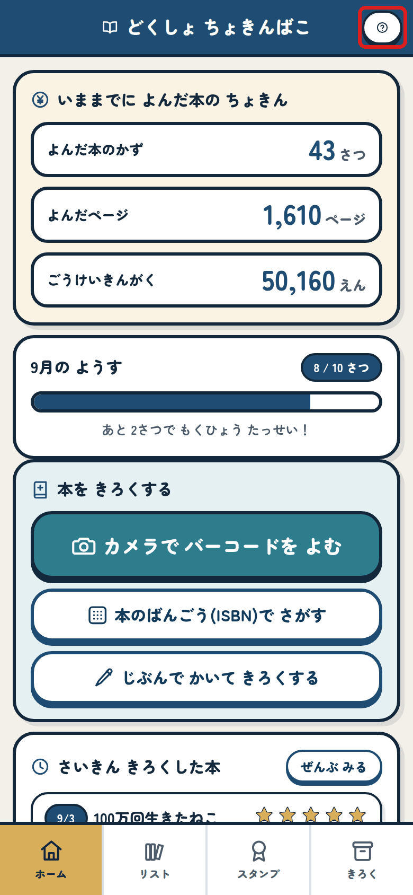

右上の 赤い わくが「？」の ボタンです。

### 本を きろくする 3つの ボタン

「本を きろくする」の 青い カードに、ボタンが 3つ ならんで います。上から、つかって ほしい じゅんに ならんで います。

- カメラで バーコードを よむ … いちばん かんたん。本の うらの バーコードに カメラを むけます
- 本のばんごう(ISBN)で さがす … カメラが つかえない ときに、バーコードの 下の すうじを 入れます
- じぶんで かいて きろくする … 本の なまえと ページ<ruby>数<rt>すう</rt></ruby>を じぶんで かきます

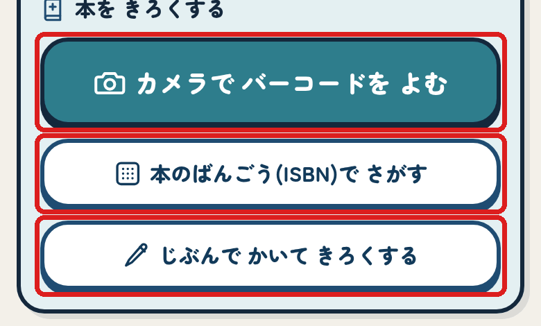

どれを おしても、さいごは おなじ「本を きろくする」の がめんに つきます。

その 下の「さいきん きろくした本」には、あたらしい じゅんに 3さつ 出ます。本を おすと「本の くわしく」が ひらきます。右の「ぜんぶ みる」を おすと リストに うつります。

### 下の 4つの タブと もどりかた

がめんの いちばん 下に タブが 4つ あります。いま ひらいて いる タブは 金いろに なります。

- ホーム … この がめん
- リスト … よんだ本の いちらん
- スタンプ … 月の もくひょうと スタンプちょう
- きろく … ふりかえり・データを のこす・つかいかた・せってい

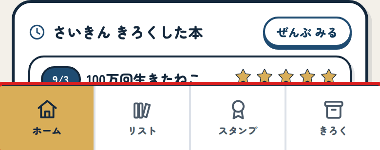

タブを おすと、その がめんに かわります。

タブの 中から べつの がめんに 入ると、下の タブが「まえの がめんに もどる」の ボタンに かわります。1つ まえに もどる やりかたは 3つ あります。

- 上の おびの 左に ある「もどる」を おす
- いちばん 下の「まえの がめんに もどる」を おす
- がめんの 左右の はしから まん中へ ゆびを すべらせる。パソコンでは キーボードの Esc キーでも もどれます

### パソコンや 大きい タブレットで ひらいた とき

がめんが ひろい ときは、ホームがめんが 左右 2れつに なります。左に ちょきんと こんげつの ようす、右に きろくの ボタンと さいきんの 本が ならびます。出て いる ものと おしかたは おなじです。

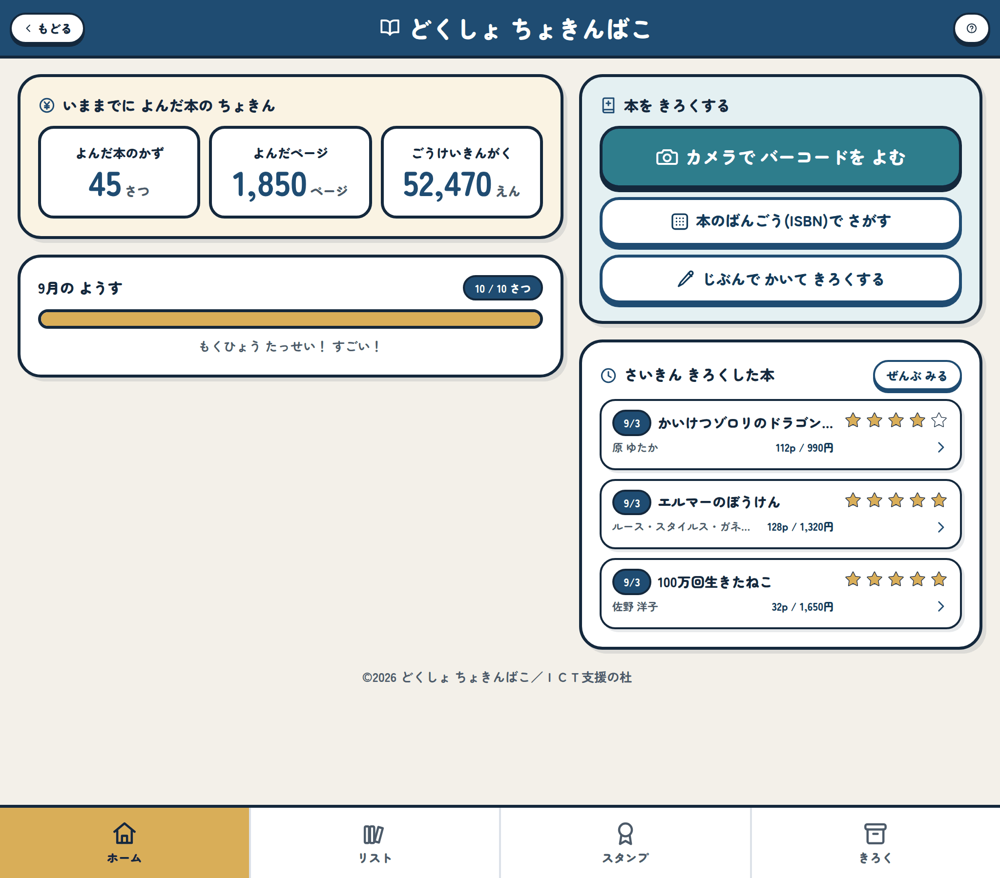

ひろい がめんでは 2れつに ならびます。

### 「？」を おすと 出る つかいかた

上の おびの 右に ある「？」を おすと、みじかい「つかいかた」が 出ます。バーコードの よみかた、ばんごうの 入れかた、もどりかた、ほしの つけかた、データの のこしかたが 1つずつ カードに なって います。「きろく」の タブの「つかいかた」からも おなじ がめんに いけます。

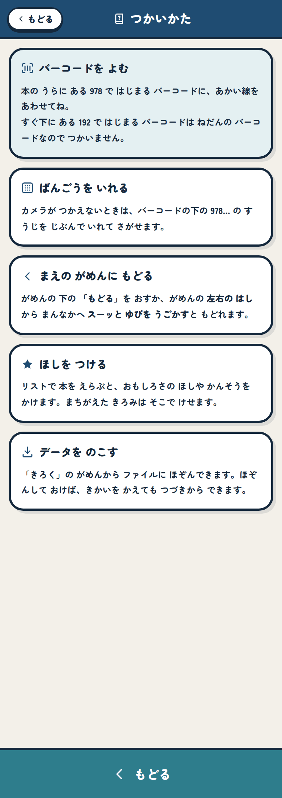

こまった ときに、まず ここを 見て ください。

## カメラで バーコードを よんで きろくする

いちばん かんたんな きろくの しかたです。本の うらの バーコードに カメラを むけるだけで、本の なまえなどが じどうで 入ります。

### よむのは 978で はじまる バーコード

日本の 本の うらには、バーコードが 2つ ならんで います。上の 978（または 979）で はじまる ほうが 本の ばんごうです。すぐ 下に ある 192（または 191）で はじまる ほうは ねだんの バーコードなので、この アプリでは つかいません。

まちがえて 下の ほうを よむと、がめんに「それは ねだんの バーコードだよ。上の 978 の ほうを よんでね」と 出ます。その ときは、<ruby>少<rt>すこ</rt></ruby>し 上に ずらして 978 の ほうを わくに 入れて ください。

### カメラで よみとる 手じゅん

1. ホームの「カメラで バーコードを よむ」を おします。
2. 「カメラを つかって いいですか」の ような かくにんが 出たら「きょか」を おします。これは ブラウザが 出す ふつうの かくにんで、あんしんして よい ものです。
3. まん中に 金いろの わくと「本の うらの 978 ではじまる バーコードに あわせてね」の 文が 出たら、カメラの じゅんびが できて います。
4. 本の うらの 978 の バーコードを わくに 入れます。本から 20 センチ くらい はなすと よく よめます。
5. よめると「よめました！」と 出て、ピッと 音が なり、じどうで「本を きろくする」の がめんに かわります。

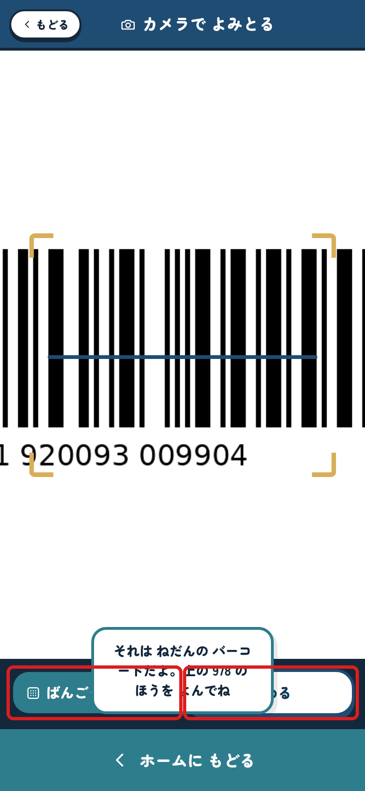

下の 978 ではない バーコードを よむと、この ように おしえて くれます。

6. 「本を きろくする」の がめんで、「しらべています…」の あとに「みつけた！」と 本の なまえが 出るのを まちます。本の なまえ・かいた人・ページ・ねだんが 入ります。入って いない らんが あれば、本を 見て かきたします。ページと ねだんが わからなかった ときは、その らんが 赤く なり「本を みて かいてね」と 出ます。
7. おもしろさの ほしと かんそうを つけます。つけなくても きろくできます。
8. 下の「この本を きろくする！」を おします。「きろく したよ！」と 出て ホームに もどります。

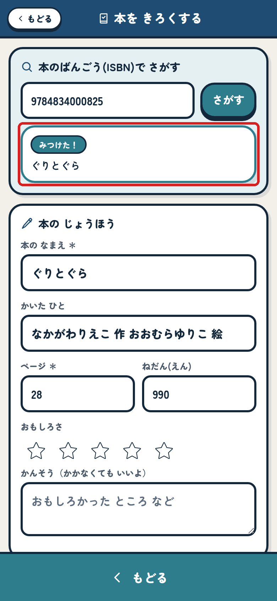

赤い わくの ところに、みつかった 本の なまえが 出ます。

### カメラが つかえない ときは「ばんごうで いれる」

カメラの がめんの 下に、ボタンが 2つ あります。「ばんごうで いれる」を おすと、カメラを やめて「本を きろくする」の がめんに うつり、バーコードの 下の すうじを じぶんで 入れられます。「やめる」を おすと ホームに もどります。

くらい ところで ライトが つかえる きかいでは、「ライト」の ボタンも 出ます。おすたびに ライトが ついたり きえたり します。

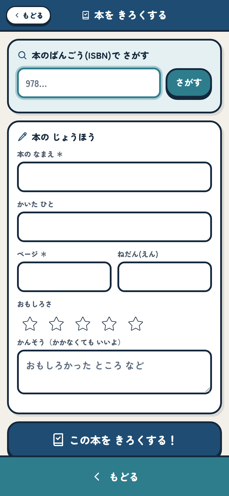

上の らんに、バーコードの 下の すうじを 入れます。

【！】おぼえて おいて ほしい こと:

- カメラは、この がめんを ひらいて いる あいだだけ うごきます。ほかの がめんに うつると じどうで <ruby>止<rt>と</rt></ruby>まります。
- 本の じょうほうを しらべる ときだけ インターネットを つかいます。おくって いるのは 本の ばんごうだけで、きかいの 中の きろくは おくりません。
- 本の じょうほうが 6びょう たっても そろわない ときは、わかった ところまでで 先に すすみます。のこりは 本を 見て かきたして ください。
- としょしつの 本は、バーコードに シールが はって ある ことが あります。その ときは「ばんごうで いれる」を つかって ください。

## 本の ばんごう（ISBN）を 入れて さがす

カメラが つかえない ときや、うまく よめない ときは、バーコードの 下に かいて ある すうじを じぶんで 入れて さがせます。

### ばんごうを 入れて「さがす」を おす

1. ホームの「本のばんごう(ISBN)で さがす」を おします。
2. いちばん 上の「本のばんごう(ISBN)で さがす」の らんに、バーコードの 下の すうじを 入れます。978 から はじまる 13けたの すうじです。ハイフンは 入れなくて かまいません。
3. 右の「さがす」を おします。キーボードの Enter キーでも さがせます。
4. 「しらべています…」の あとに「みつけた！」と 出て、本の なまえ・かいた人・ページ・ねだんが 入ります。
5. のこりを かきたして「この本を きろくする！」を おします。

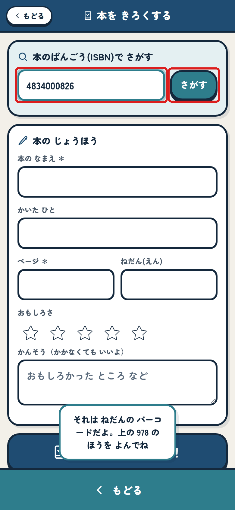

赤い わくに すうじを 入れて、右の「さがす」を おします。

ふるい 本には、978 が つかない 10けたの ばんごうが かいて ある ことが あります。10けたの ままで 入れても、アプリが 13けたに なおして さがして くれます。しゃしんの 4834000826 は その れいです。

### みつからなかった とき

「みつかりませんでした。下の らんに じぶんで かいて きろく できます。」と 出る ことが あります。ばんごうは あって いるのに、しらべ先に その 本が のって いない ときや、インターネットに つながって いない ときです。

その ときは、そのまま 下の「本の じょうほう」の らんに、本の なまえと ページ<ruby>数<rt>すう</rt></ruby>を じぶんで かいて きろくして ください。

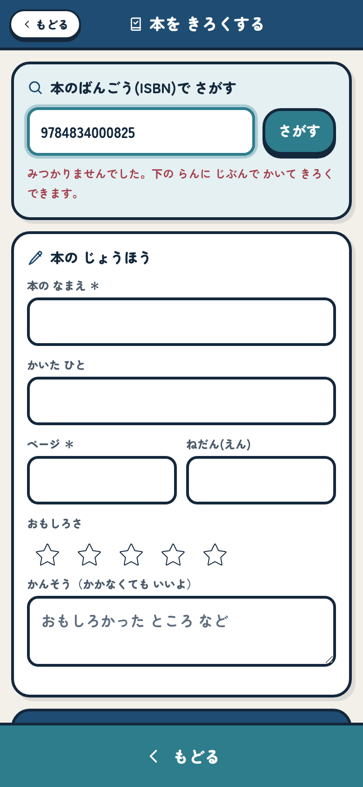

赤い 文が 出ても、下の らんに かけば きろくできます。

### ばんごうが ちがう とき

「978で はじまる 13けたの すうじを いれてね」と 出た ときは、入れた すうじが 本の ばんごうの <ruby>形<rt>かたち</rt></ruby>に なって いません。けたが たりない、1けた まちがえて いる、192 の ほう（ねだんの バーコード）の すうじを 入れて いる、の どれかです。もういちど 本を 見て 入れなおして ください。

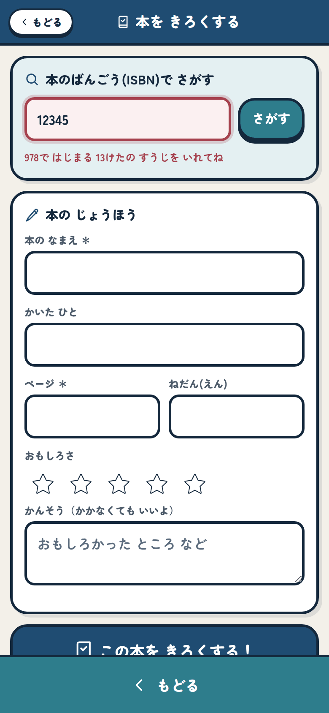

らんが 赤く なり、上の 文が 出ます。

【！】おぼえて おいて ほしい こと:

- しらべ先は 3つ あります（openBD・Google Books・<ruby>国立国会図書館<rt>こくりつこっかいとしょかん</rt></ruby>サーチ）。3つ ぜんぶに きいて、そろった ものから つかいます。
- ページと ねだんが しらべ先に なかった ときは、その らんだけ 赤く なります。本の おくづけを 見て かいて ください。
- おなじ 本を もう 1<ruby>回<rt>かい</rt></ruby> さがしても、きろくは ふえません。ふえるのは「この本を きろくする！」を おした ときだけです。

## じぶんで かいて きろくする

バーコードの ない 本、ふるい 本、みつからなかった 本は、じぶんで かいて きろくします。かならず 入れるのは 2つだけです。

### かならず 入れる ところは 2つ

「本の じょうほう」の 中で、＊の ついた らんは かならず 入れます。

- 本の なまえ ＊
- ページ ＊

ほかの らんは 入れなくても きろくできます。

- かいた ひと … 入れないと「ふめい」に なります
- ねだん(えん) … 入れないと 0円 として かぞえます
- おもしろさ … ほしを 1つから 5つまで。あとから かえられます
- かんそう … 200字まで。あとから かきたせます

なまえや ページを 入れずに「この本を きろくする！」を おすと、「本の なまえを いれてね」「ページすうを いれてね」と 出て、その らんが 赤く なります。

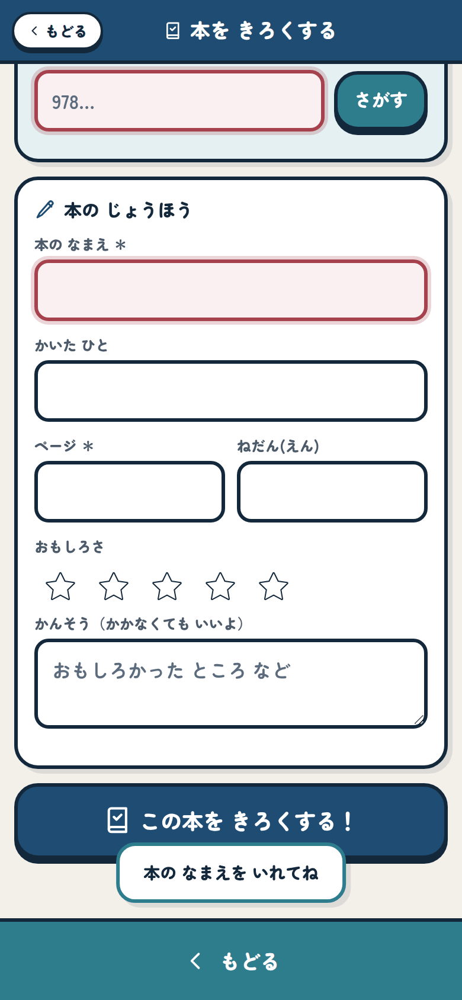

赤く なった らんを 入れれば、きろくできます。

### 本の じょうほうを 入れて きろくする

1. ホームの「じぶんで かいて きろくする」を おします。「本を きろくする」の がめんが ひらき、「本の なまえ」の らんに カーソルが 入ります。
2. 本の なまえを 入れます。
3. かいた ひとを 入れます（入れなくても かまいません）。
4. ページと ねだん(えん)を すうじで 入れます。
5. おもしろさの ほしを おします。おなじ ほしを もう 1<ruby>回<rt>かい</rt></ruby> おすと 0に もどります。
6. かんそうを かきます（かかなくても かまいません）。
7. 「この本を きろくする！」を おします。

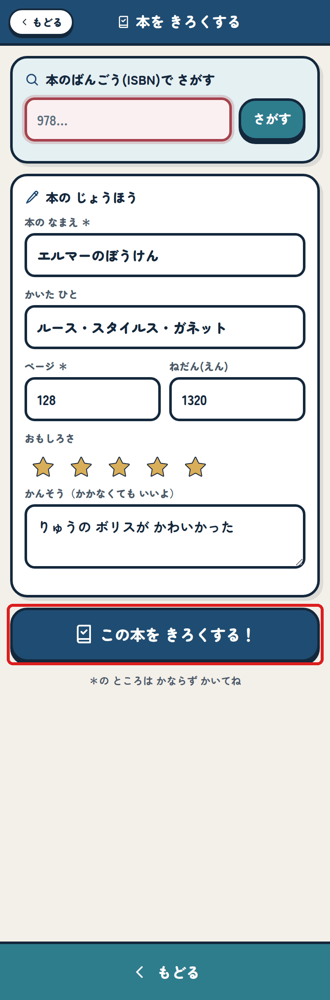

赤い わくの ボタンで きろくします。

おすと「きろく したよ！」と 本の なまえが 出て、ホームに もどります。ちょきんの かずが ふえて、「さいきん きろくした本」の いちばん 上に その 本が ならびます。

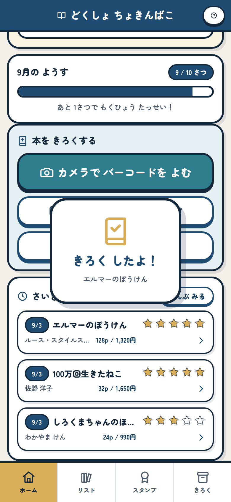

きろく できると、この ように 出ます。

### おなじ本が あります と 出た とき

すでに きろくして ある 本と おなじ なまえ（または おなじ ばんごう）を きろくしようと すると、「おなじ本が あります」と 出て、いつ きろくしたかを おしえて くれます。

- おなじ 本を もう 1<ruby>回<rt>かい</rt></ruby> よんだので、また きろくしたい とき … 「きろくする」を おします。2さつめとして きろくされます。
- まちがえて 2<ruby>回<rt>かい</rt></ruby> 入れそうに なった とき … 「やめる」を おします。<ruby>何<rt>なに</rt></ruby>も きろくされません。

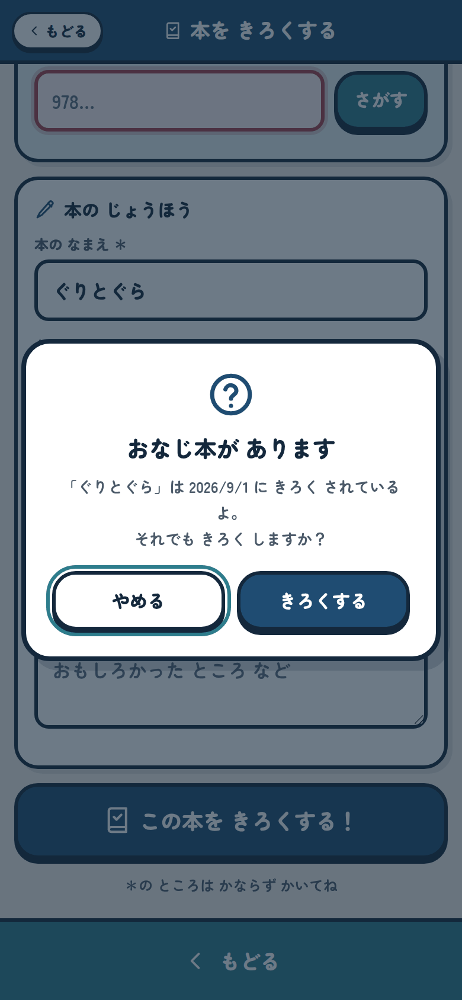

「やめる」か「きろくする」を えらびます。

【！】おぼえて おいて ほしい こと:

- 本の なまえは 120字まで、かいた ひとは 80字まで、かんそうは 200字まで 入ります。
- ページは 1 から 20000 まで、ねだんは 0 から 1000000 まで 入ります。
- 「もどる」で がめんを はなれると、入れて いた ものは きえます。とちゅうで やめる ときは 気を つけて ください。
- きろくした 本の ほしと かんそうは、あとから「本の くわしく」で かえられます。なまえ・ページ・ねだんは あとから かえられません。まちがえた ときは、その きろくを けして、もういちど 入れて ください。

## よんだ本の リストを みる・さがす

下の「リスト」タブを おすと、よんだ本が あたらしい じゅんに ならびます。月ごと・年ごと・ぜんぶ の きりかえと、なまえでの さがしものが できます。

### この月・この年・ぜんぶ を きりかえる

リストの 上の カードに、年と 月の えらぶ ところと、「この月」「この年」「ぜんぶ」の 3つの ボタンが あります。いま えらんで いる ものが こい 青に なります。

- この月 … えらんだ 年と 月の 本だけ
- この年 … えらんだ 年の 本 ぜんぶ。月の えらぶ ところは おせなく なります
- ぜんぶ … いままでの 本 ぜんぶ。年も 月も おせなく なります

その 下に、いま 出て いる 本の さつ<ruby>数<rt>すう</rt></ruby>・ページ<ruby>数<rt>すう</rt></ruby>・きんがくが 3つの まるい しるしで 出ます。

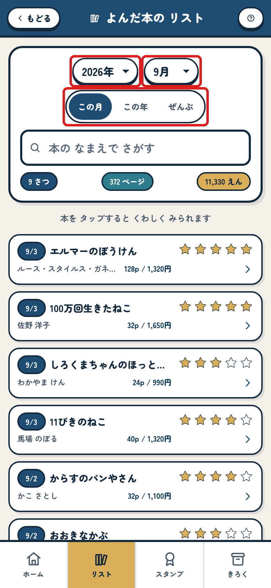

上の 赤い わくで、年・月と はんいを きりかえます。

まえの 月を 見たい ときは、「この月」の まま 月の えらぶ ところを おして、見たい 月を えらびます。年を かえる ときも おなじです。

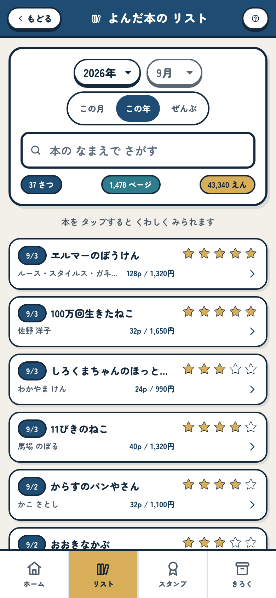

「この年」に すると、その 年の ぜんぶの 本が 出ます。

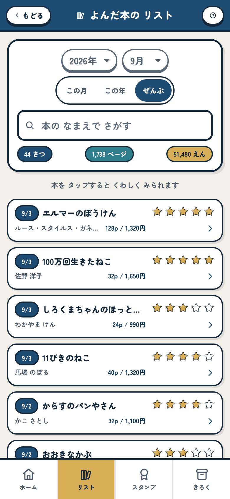

「ぜんぶ」に すると、いままでの 本が ぜんぶ 出ます。

1さつの <ruby>行<rt>ぎょう</rt></ruby>には、きろくした 日、本の なまえ、かいた ひと、ページ<ruby>数<rt>すう</rt></ruby>と ねだん、ほしが 出ます。本を おすと「本の くわしく」が ひらきます。

### 本の なまえや かいた人で さがす

「本の なまえで さがす」の らんに 文字を 入れると、その 文字が なまえか かいた ひとに 入って いる 本だけに しぼられます。入れて いる とちゅうで、リストが すぐに かわります。

1. さがしたい はんい（この月・この年・ぜんぶ）を えらびます。
2. 「本の なまえで さがす」の らんに、なまえの <ruby>一部<rt>いちぶ</rt></ruby>を 入れます。たとえば「ねこ」と 入れると、なまえに「ねこ」の 入った 本だけに なります。
3. さがし おわったら、らんの 中を けします。ぜんぶの 本に もどります。

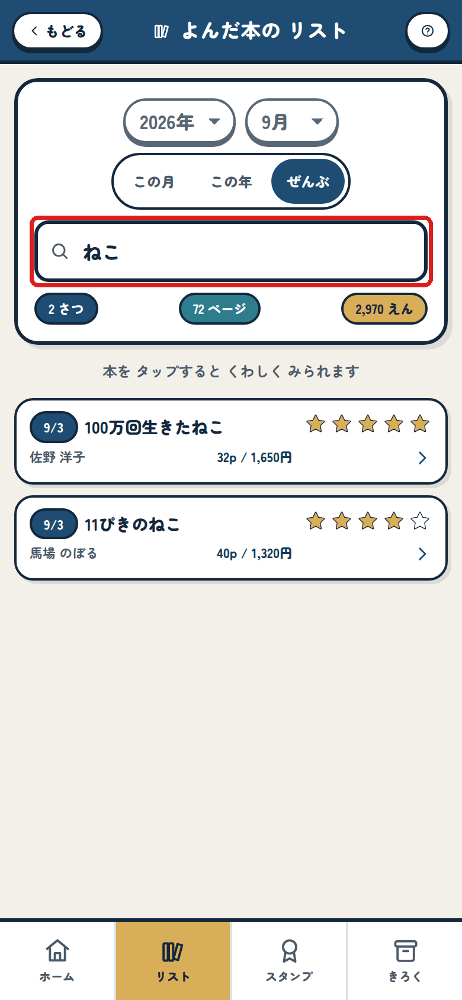

赤い わくに 文字を 入れると、しぼられます。

【！】おぼえて おいて ほしい こと:

- さがすのは、いま えらんで いる はんいの 中だけです。「この月」の まま さがすと、ほかの 月の 本は 出ません。見つからない ときは「ぜんぶ」に して さがして ください。
- 「みつかりませんでした」と 出たら、その 文字の 本は はんいの 中に ありません。
- リストで えらんだ 年と 月は、スタンプの がめんと つながって います。ここで 7月を えらぶと、スタンプも 7月に なります。

## 本の くわしくで ほしと かんそうを かえる・1さつだけ けす

リストか ホームの「さいきん きろくした本」で 本を おすと、「本の くわしく」が ひらきます。ここでは、ほしと かんそうを あとから かえたり、まちがえた きろくを 1さつだけ けしたり できます。

### ほしと かんそうを かえる

「本の くわしく」には、きろくした 日、本の なまえ、かいた ひと、ページ、ねだん、（あれば）本の ばんごうが 出ます。

1. 「おもしろさ」の ほしを おします。おした ところまで 金いろに なり、その <ruby>場<rt>ば</rt></ruby>で ほぞんされます。おなじ ほしを もう 1<ruby>回<rt>かい</rt></ruby> おすと 0に もどります。
2. 「かんそう」の らんに 文を 入れます。
3. 「かんそうを ほぞん」を おします。「かんそうを ほぞんしました」と 出ます。

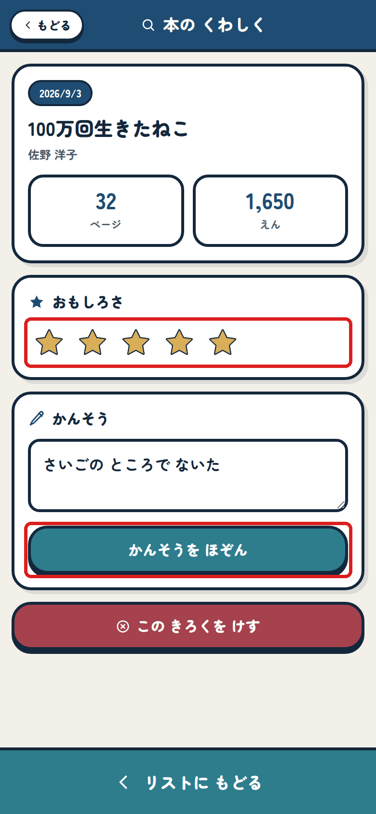

赤い わくの ほしと ボタンで かえます。

かんそうは「かんそうを ほぞん」を おすまで ほぞんされません。かいた あとに「もどる」を おすと、かいた ものは きえます。

### この きろくを 1さつだけ けす

まちがえて 入れた 本は、ここから 1さつだけ けせます。

1. いちばん 下の 赤い「この きろくを けす」を おします。
2. 「この きろくを けしますか？」と 出ます。本の なまえを たしかめて「けす」を おします。やめる ときは「やめる」を おします。
3. 「けしました」と 出て、リストに もどります。

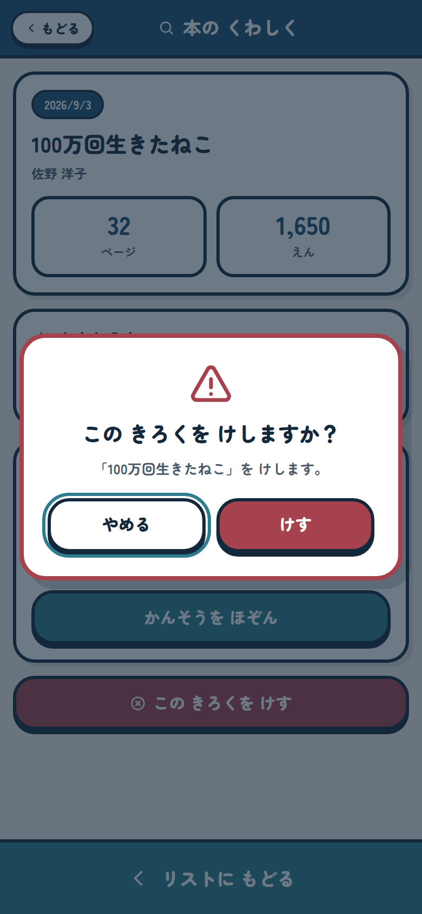

「けす」を おすと、その 1さつだけが きえます。

【！！】けす まえに 気を つける こと:

- けした きろくは もとに もどせません。
- けすと、ちょきんの さつ<ruby>数<rt>すう</rt></ruby>・ページ<ruby>数<rt>すう</rt></ruby>・きんがくも その ぶん へります。その 月の スタンプも 1つ へります。
- ぜんぶを けしたい ときは、ここでは なく「きろく」タブの「きろくを ぜんぶ けす」を つかいます。

## スタンプちょうと 月の もくひょう

下の「スタンプ」タブを おすと、その 月の もくひょうと、1さつ よむ ごとに たまって いく スタンプちょうが 出ます。

### スタンプちょうの みかた

上の カードには、年と 月の えらぶ ところと、「もくひょう」の かずが あります。その 下の「スタンプ」の カードには、「9 / 10」の ように いま <ruby>何<rt>なん</rt></ruby>さつ よんだかと、ぼうの グラフ、スタンプの マスが ならびます。

よんだ さつ<ruby>数<rt>すう</rt></ruby>の ぶんだけ マスに スタンプが おされて いき、下に「あと 1さつ！」と 出ます。もくひょうに とどくと「もくひょう たっせい！ よく がんばったね」に かわり、ぼうが 金いろに なります。

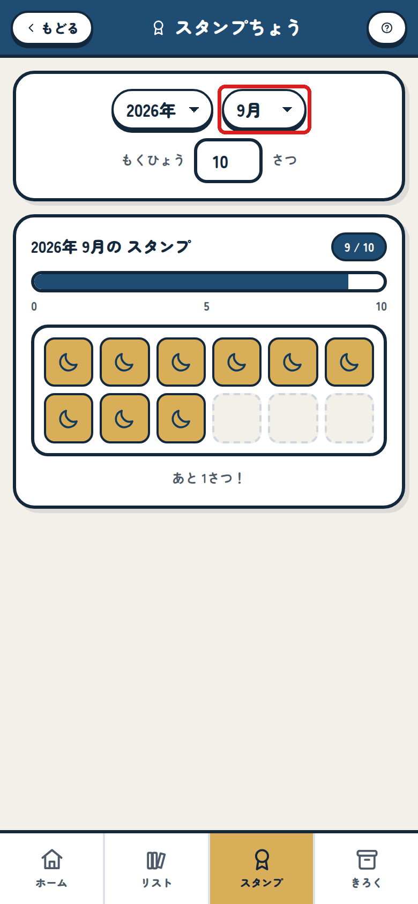

赤い わくの ところで 月を えらべます。

### 月の もくひょうを かえる

もくひょうは 月ごとに <ruby>決<rt>き</rt></ruby>められます。はじめは どの 月も 10さつです。

1. 「もくひょう」の となりの かずの らんを おします。
2. 1 から 99 までの かずを 入れます。
3. らんの そとを おすと、すぐに ほぞんされて、「/ 15」の ように 上の かずと ぼうが かわります。

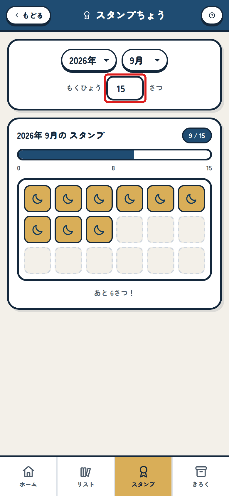

赤い わくの かずを かえると、もくひょうが かわります。

もくひょうは、えらんで いる 月の ぶんだけ かわります。ほかの 月は 10さつの ままです。

### まえの 月の スタンプを みる

月の えらぶ ところで まえの 月を えらぶと、その 月の スタンプちょうが 出ます。スタンプの <ruby>絵<rt>え</rt></ruby>は 月ごとに ちがいます。12か月 ぜんぶ ちがう <ruby>絵<rt>え</rt></ruby>に なって いるので、月が かわると あたらしい <ruby>絵<rt>え</rt></ruby>が おされます。

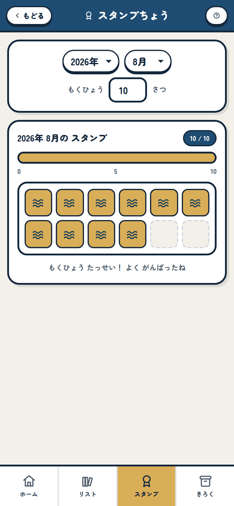

もくひょうに とどいた 月は、ぼうが 金いろに なります。

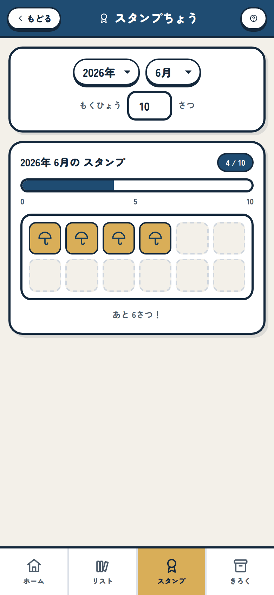

月が ちがうと、スタンプの <ruby>絵<rt>え</rt></ruby>も ちがいます。

### まえの 月の 本を あとから きろくする

きろくを わすれて いた 本を、まえの 月の ぶんとして 入れられます。

1. スタンプ（または リスト）の がめんで、入れたい 年と 月を えらびます。
2. 「ホーム」タブに もどり、「カメラで バーコードを よむ」「本のばんごう(ISBN)で さがす」「じぶんで かいて きろくする」の どれかを おします。
3. 「本を きろくする」の がめんの 下に、金いろで「この きろくは 2026年7月に なります」の ように 出て いる ことを たしかめます。
4. いつもの ように 入れて「この本を きろくする！」を おします。その 月の きろくとして のこり、その 月の スタンプが 1つ ふえます。

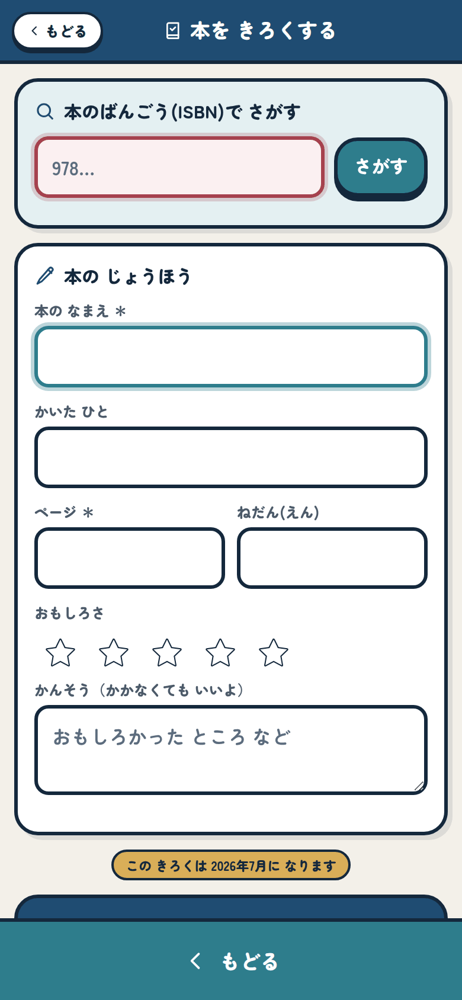

金いろの しるしが 出て いれば、その 月の きろくに なります。

おわったら、スタンプの がめんで 月を いまの 月に もどして おいて ください。もどさないと、つぎに 入れる 本も まえの 月の きろくに なります。

### もくひょうに とどいた ときの おいわい

その 月の もくひょうに はじめて とどいた ときだけ、<ruby>紙<rt>かみ</rt></ruby>ふぶきが まって「もくひょう たっせい！」と 出て、ファンファーレが なります。

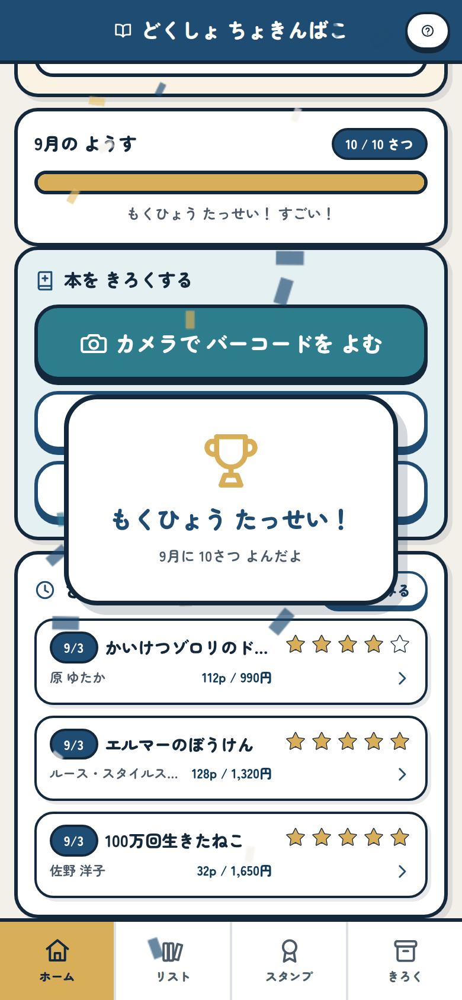

もくひょうの さつ<ruby>数<rt>すう</rt></ruby>に とどいた ときに 出ます。

スタンプが ぜんぶ おされ、「よく がんばったね」に かわります。

【！】おぼえて おいて ほしい こと:

- おいわいは、1つの 月に 1<ruby>回<rt>かい</rt></ruby>だけ 出ます。とどいた あとに さらに よんでも、2<ruby>回<rt>かい</rt></ruby>めは 出ません。
- もくひょうを あとから 小さく して とどいた ときも、おいわいは 出ます。
- きかいの「<ruby>視差効果<rt>しさこうか</rt></ruby>を<ruby>減<rt>へ</rt></ruby>らす」（うごきを へらす せってい）が オンの ときは、<ruby>紙<rt>かみ</rt></ruby>ふぶきは 出ません。文字と 音だけで おいわいします。
- ここで えらんだ 年と 月は、アプリを とじると いまの 月に もどります。

## どくしょの ふりかえりを グラフで みる

「きろく」タブの「どくしょの ふりかえり」を おすと、いままでの ごうけいと、月ごとの さつ<ruby>数<rt>すう</rt></ruby>の グラフが 出ます。1年 つづけた ようすを ここで 見わたせます。

### ふりかえりの がめんを ひらく

1. 下の「きろく」タブを おします。
2. いちばん 上の「どくしょの ふりかえり」を おします。

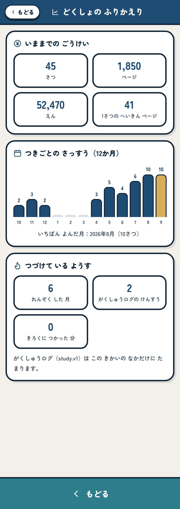

上から ごうけい、月ごとの グラフ、つづけて いる ようす です。

### グラフと かずの みかた

「いままでの ごうけい」には 4つの かずが 出ます。

- さつ … いままでに きろくした 本の かず
- ページ … ぜんぶの ページ<ruby>数<rt>すう</rt></ruby>
- えん … ぜんぶの ねだん
- 1さつの へいきん ページ … ページ<ruby>数<rt>すう</rt></ruby>を さつ<ruby>数<rt>すう</rt></ruby>で わった かず

「つきごとの さっすう（12か月）」は、いまの 月から 12か月 まえまでの さつ<ruby>数<rt>すう</rt></ruby>の ぼうグラフです。いまの 月の ぼうは <ruby>色<rt>いろ</rt></ruby>が ちがいます。ぼうの 上に さつ<ruby>数<rt>すう</rt></ruby>、下に 月の かずが 出ます。下の 文に、いちばん よんだ 月が 出ます。

「つづけて いる ようす」には 3つの かずが 出ます。

- れんぞく した 月 … いまの 月から さかのぼって、1さつでも よんだ 月が <ruby>何<rt>なん</rt></ruby>か月 つづいて いるか
- がくしゅうログの けんすう … この きかいに のこって いる、この アプリの きろくの かず
- きろくに つかった <ruby>分<rt>ふん</rt></ruby> … アプリで きろくの そうさを して いた <ruby>時間<rt>じかん</rt></ruby>を <ruby>分<rt>ふん</rt></ruby>で たした かず。本を よんで いた <ruby>時間<rt>じかん</rt></ruby>では ありません

【！】おぼえて おいて ほしい こと:

- この がめんは 見るだけです。かずを 手で かえる ことは できません。
- 1か月 でも きろくの ない 月が あると、「れんぞく した 月」は そこで <ruby>止<rt>と</rt></ruby>まります。
- グラフは 12か月 ぶんだけです。それより まえの 本は「いままでの ごうけい」にだけ 入って います。

## データを のこす・よみこむ（きかいを かえる とき）

きろくは きかいの 中だけに あるので、きかいを かえると <ruby>引<rt>ひ</rt></ruby>きつがれません。きかいを かえる まえ、しんきゅうの まえ、ながい 休みの まえには、ここで ファイルに のこして おいて ください。

### 「きろく」の がめんから ひらく

1. 下の「きろく」タブを おします。
2. 「データを のこす・よみこむ」を おします。

「きろく」の がめんには、上から「どくしょの ふりかえり」「データを のこす・よみこむ」「つかいかた」「おとを ならす」「きろくを ぜんぶ けす」が ならび、いちばん 下に「このアプリについて」が あります。

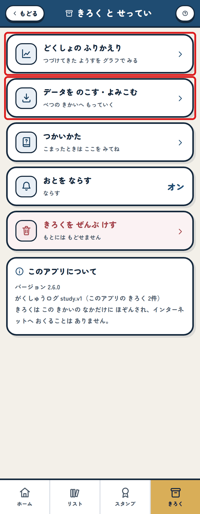

赤い わくの 2つは、この しょうと 1つ まえの しょうで つかいます。

### ファイルに ほぞんする

1. 「データを のこす」の カードの「ファイルに ほぞんする」を おします。
2. 「ファイルに ほぞんしました」と 出て、dokusho-chokinbako_2026-09-03.json の ような 名まえの ファイルが きかいに ほぞんされます。名まえの おわりの すうじは、ほぞんした 日です。
3. その ファイルを、Google ドライブなど なくならない ところに うつして おきます。

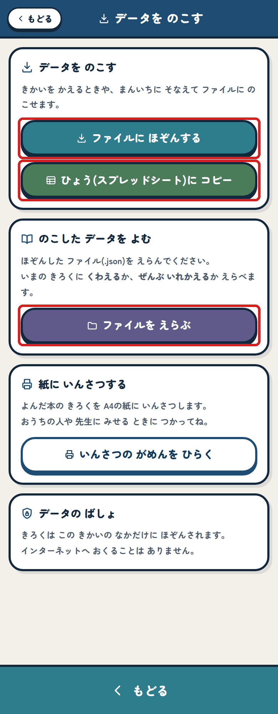

赤い わくの 3つの ボタンを、この しょうで つかいます。

ファイルには、よんだ本の きろくと、月ごとの もくひょうと、おいわいずみの 月が 入ります。なまえなど 人を あらわす ものは 入って いません。

### ひょう（スプレッドシート）に コピーする

「ひょう(スプレッドシート)に コピー」を おすと、きろくが ひょうに はりつけられる <ruby>形<rt>かたち</rt></ruby>で コピーされます。Google スプレッドシートや Excel を ひらいて はりつけると、1さつが 1<ruby>行<rt>ぎょう</rt></ruby>に ならびます。

ならびは <ruby>古<rt>ふる</rt></ruby>い じゅんで、れつは つぎの 9つです。

<ruby>日付<rt>ひづけ</rt></ruby>、タイトル、かいた人、おもしろさ、ページ<ruby>数<rt>すう</rt></ruby>、ごうけいページ、きんがく、ごうけいきんがく、かんそう

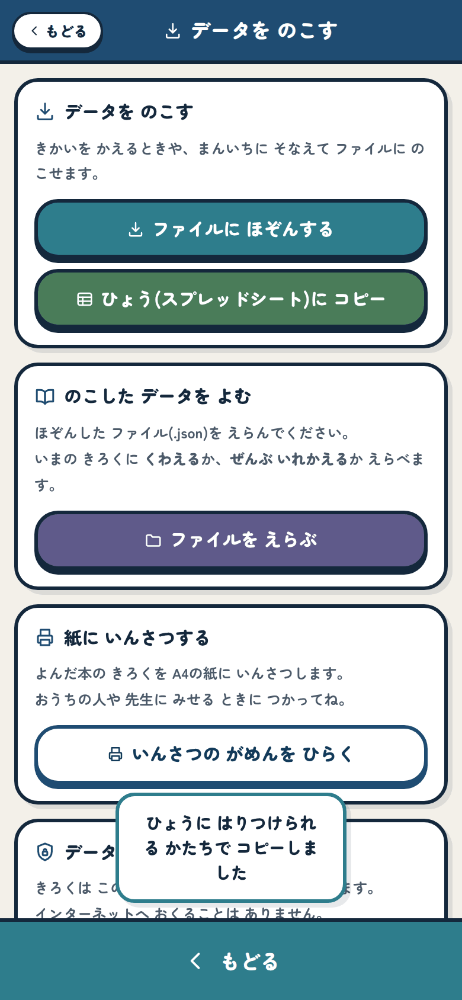

「コピーしました」と 出たら、ひょうに はりつけられます。

### のこした ファイルを よみこむ（くわえる・いれかえる）

あたらしい きかいで、のこした ファイルを よみこみます。

1. あたらしい きかいで「きろく」タブの「データを のこす・よみこむ」を ひらきます。
2. 「のこした データを よむ」の カードの「ファイルを えらぶ」を おします。
3. ほぞんして あった .json の ファイルを えらびます。
4. 「◯さつ ぶんの きろくが あります」と 出ます。いまの きろくの さつ<ruby>数<rt>すう</rt></ruby>も 出ます。
5. 「くわえる」か「いれかえる」を えらびます。

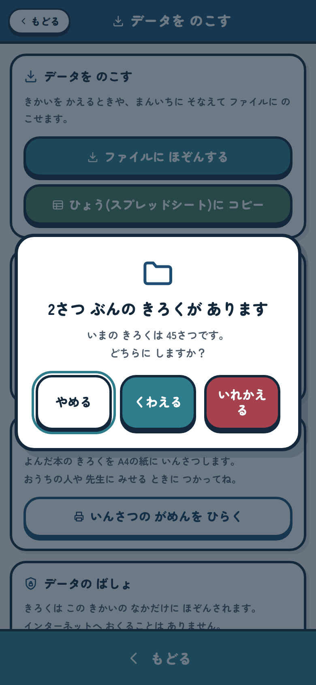

「くわえる」か「いれかえる」を えらびます。

- くわえる … いまの きろくに、ファイルの きろくを たします。おなじ きろくが すでに ある ときは、<ruby>二重<rt>にじゅう</rt></ruby>には 入りません。
- いれかえる … いまの きろくを ぜんぶ けして、ファイルの きろくだけに します。「ぜんぶ いれかえます」と もう 1<ruby>回<rt>かい</rt></ruby> かくにんが 出るので、「いれかえる」を おします。

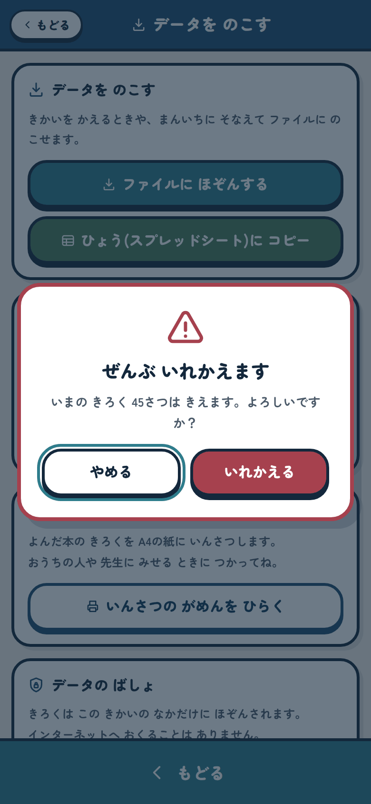

「いれかえる」を おすと、いまの きろくは きえます。

【！！】気を つける こと:

- 「いれかえる」を おすと、いまの きかいに あった きろくは もどせません。まよったら、先に「ファイルに ほぞんする」で いまの きろくも のこして おいて ください。
- 「よみこめない ファイルでした」「データの かたちが ちがいます」と 出た ときは、えらんだ ファイルが この アプリの ものでは ありません。ほかの ファイルを えらんで ください。
- ふるい アドレス（gigayama.github.io/Reading-Books/）で つかって いた きろくは、その まま では <ruby>引<rt>ひ</rt></ruby>きつがれません。ふるい ほうで「ファイルに ほぞんする」を して、あたらしい ほうで よみこんで ください。

## よんだ本の きろくを <ruby>紙<rt>かみ</rt></ruby>に いんさつする

よんだ本の きろくを、A4の <ruby>紙<rt>かみ</rt></ruby> に まとめて いんさつできます。じゅぎょうさんかんや おうちの人に 見せる ときに つかえます。

### いんさつの がめんを ひらく

1. 下の「きろく」タブを おします。
2. 「データを のこす・よみこむ」を おします。
3. 「<ruby>紙<rt>かみ</rt></ruby>に いんさつする」の カードの「いんさつの がめんを ひらく」を おします。
4. ブラウザの いんさつの がめんが 出ます。左に、<ruby>紙<rt>かみ</rt></ruby>に 出る <ruby>絵<rt>え</rt></ruby>が 見えます。
5. <ruby>用紙<rt>ようし</rt></ruby>が A4、むきが たて に なって いる ことを たしかめて、「<ruby>印刷<rt>いんさつ</rt></ruby>」を おします。

きろくが 1さつも ない ときは「きろくが ありません」と 出て、いんさつの がめんは ひらきません。

### <ruby>紙<rt>かみ</rt></ruby>に 出る もの

<ruby>紙<rt>かみ</rt></ruby>には、いま きかいに ある きろくが ぜんぶ、<ruby>古<rt>ふる</rt></ruby>い じゅんに 出ます。リストで しぼって いても、いんさつには かんけい ありません。

- 「どくしょ ちょきんばこ」の <ruby>題<rt>だい</rt></ruby>と、いんさつした 日
- なまえ と クラス の <ruby>書<rt>か</rt></ruby>く ところ。ここは わざと あいて います。アプリは なまえを もって いないので、<ruby>紙<rt>かみ</rt></ruby>に 手で <ruby>書<rt>か</rt></ruby>きます
- ぜんぶの さつ<ruby>数<rt>すう</rt></ruby>・ページ<ruby>数<rt>すう</rt></ruby>・きんがく
- 1さつずつの ひょう（ばんごう・よんだ日・本の なまえと かんそう・かいた人・ページ・ねだん・ほし）

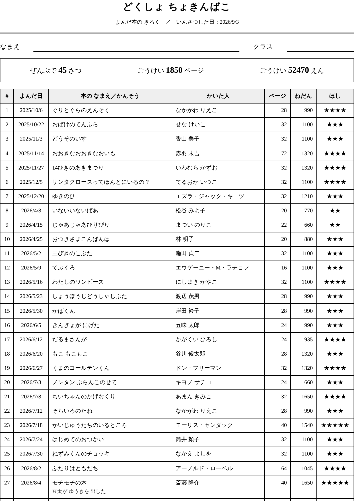

A4 たて 1まいに、この ように 出ます。

【！】おぼえて おいて ほしい こと:

- 本が <ruby>多<rt>おお</rt></ruby>くて 1まいに 入らない ときは、2まいめに つづきます。ひょうの 見出しの <ruby>行<rt>ぎょう</rt></ruby>は 2まいめにも 出ます。
- 1さつの <ruby>行<rt>ぎょう</rt></ruby>が とちゅうで <ruby>切<rt>き</rt></ruby>れる ことは ありません。
- <ruby>横<rt>よこ</rt></ruby>に <ruby>切<rt>き</rt></ruby>れて 見える ときは、いんさつの がめんの「<ruby>用紙<rt>ようし</rt></ruby>」が A4、「<ruby>向<rt>む</rt></ruby>き」が たて に なって いるか たしかめて ください。
- パソコンでは、キーボードの Ctrl と P を いっしょに おしても、おなじ ものが いんさつできます。

## おとの オン・オフと アプリの じょうほう

きろくした ときの ピッという 音や ファンファーレは、ならさない ように できます。アプリの バージョンも ここで 見られます。

### おとを ならす・ならさない

1. 下の「きろく」タブを おします。
2. 「おとを ならす」の <ruby>行<rt>ぎょう</rt></ruby>を おします。おすたびに、右はしが「オン」と「オフ」で 入れかわります。
3. 「オフ」に すると「おとを ならしません」と 出て、それからは 音が なりません。

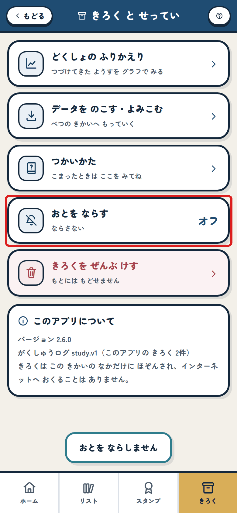

右はしが「オフ」に なって いれば、音は なりません。

音の せっていは、きろくを ぜんぶ けしても のこります。

### このアプリについて（バージョン）

「きろく」の がめんの いちばん 下の「このアプリについて」には、つぎの ものが 出ます。

- バージョン … いま つかって いる アプリの <ruby>版<rt>はん</rt></ruby>の ばんごう
- がくしゅうログ … この きかいに のこって いる きろくの けんすう
- きろくは この きかいの なかだけに ほぞんされる、という せつめい

先生に「どの バージョンを つかって いますか」と きかれたら、ここを 見て こたえて ください。

## 【！！】きろくを ぜんぶ けす

しんきゅうで きかいを つぎの 人に わたす ときなど、きろくを ぜんぶ けしたい ときに つかいます。けした ものは もとに もどせないので、かならず 先に ほぞんして ください。

### けす まえに かならず ほぞんする

「きろく」タブの いちばん 下、赤い 文字の「きろくを ぜんぶ けす」を おすと、「ぜんぶ けす」の がめんが ひらきます。

この がめんには ボタンが 3つ あります。

- さきに ほぞんする … きろくを ファイルに のこします。「ファイルに ほぞんする」と おなじです
- ほんとうに ぜんぶ けす … けします
- やめる … <ruby>何<rt>なに</rt></ruby>も せずに もどります

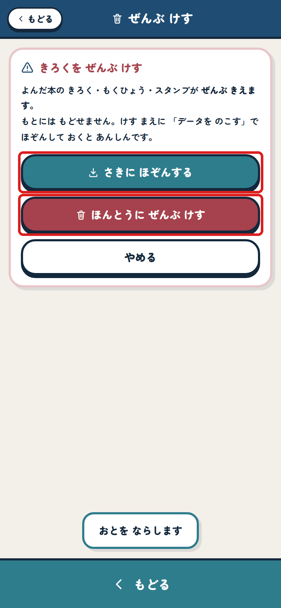

上の わくが「さきに ほぞんする」、下の わくが けす ボタンです。

### ぜんぶ けす 手じゅん

1. 「さきに ほぞんする」を おして、ファイルを のこします。
2. 「ほんとうに ぜんぶ けす」を おします。
3. 「ほんとうに ぜんぶ けしますか？」と 出ます。もう 1<ruby>回<rt>かい</rt></ruby> たしかめて「ぜんぶ けす」を おします。
4. 「きろくを ぜんぶ けしました」と 出て、ホームに もどります。ちょきんは ぜんぶ 0に なります。

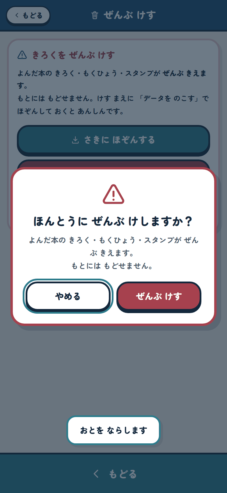

ここで「ぜんぶ けす」を おすと、もどせません。

【！！】もっとも 気を つける こと:

- きえるのは、よんだ本の きろく・月ごとの もくひょう・おいわいずみの 月 の 3つです。
- 音の オン・オフの せっていは のこります。
- おなじ きかいに 入って いる ほかの <ruby>学習<rt>がくしゅう</rt></ruby>アプリの きろくは きえません。
- もとには もどせません。「さきに ほぞんする」を おして いれば、「データを のこす・よみこむ」から もどせます。

## うまく いかない とき

こまった ときは、まず ここを 見て ください。それでも なおらない ときの <ruby>聞<rt>き</rt></ruby>き先は、さいごに <ruby>書<rt>か</rt></ruby>いて あります。

### カメラが ひらかない・まっくろ

「カメラを つかう きょかが ありません」と 出た ときは、ブラウザが カメラを つかう ことを ゆるして いません。アドレスの 左の かぎの しるしを おして、「カメラ」を「<ruby>許可<rt>きょか</rt></ruby>」に して、もういちど ひらいて ください。Chromebook では、せっていの「プライバシーとセキュリティ」の「サイトの<ruby>設定<rt>せってい</rt></ruby>」の「カメラ」からも かえられます。

「カメラが みつかりませんでした」と 出た ときは、その きかいに カメラが ないか、ブラウザから 見えて いません。「ばんごうで いれる」で すうじを 入れて ください。

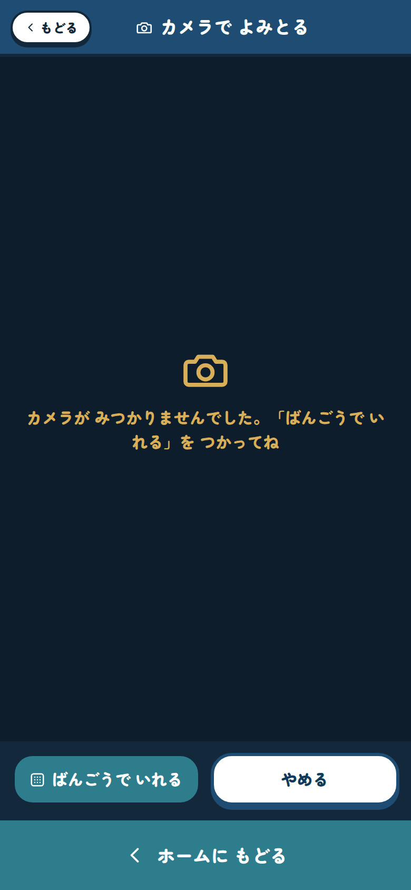

この 文が 出たら、下の「ばんごうで いれる」を おします。

カメラの がめんが まっくろの ときは、ほかの アプリ（Meet など）が カメラを つかって いないか たしかめて ください。

### バーコードが よめない

- ピントが あわない … 本を 20 センチ くらい はなします。ちかづけすぎると よめません。
- くらい … 「ライト」の ボタンが あれば おします。まどの ほうを むくのも よい <ruby>方<rt>ほう</rt></ruby>ほうです。
- ひかって しまう … けいこうとうの まっすぐ 下を さけて、<ruby>少<rt>すこ</rt></ruby>し ななめに します。
- なんど やっても よめない … 「ばんごうで いれる」で、バーコードの 下の 978 から はじまる すうじを 入れます。
- 978 の バーコードが ない ふるい 本 … 「じぶんで かいて きろくする」で、なまえと ページ<ruby>数<rt>すう</rt></ruby>を 入れます。うらや おくづけに 10けたの ばんごうが あれば、それを 入れても さがせます。

### 本の じょうほうが 出てこない

「みつかりませんでした」と 出る ときは、しらべ先に その 本が のって いないか、学校の インターネットが しらべ先への つうしんを <ruby>止<rt>と</rt></ruby>めて います。「じぶんで かいて きろくする」で、なまえと ページ<ruby>数<rt>すう</rt></ruby>を 入れれば きろくできます。

先生へ。学校の フィルタリングで <ruby>止<rt>と</rt></ruby>まって いる ときは、この ページの 下に ある「学校で<ruby>使<rt>つか</rt></ruby>うときは」の ところに <ruby>書<rt>か</rt></ruby>いて ある アドレスを ゆるして ください。

### きろくが きえた

きろくは ブラウザごとに <ruby>分<rt>わ</rt></ruby>かれて います。つぎの ことを たしかめて ください。

- べつの ブラウザで ひらいて いないか（Chrome で 入れた きろくは Safari には 出ません）
- シークレットウィンドウで つかって いないか（とじると きえます）
- iPad で 7日 いじょう ひらいて いなかった か（ホームがめんに 入れて おくと おきにくく なります）
- ブラウザの「<ruby>閲覧履歴<rt>えつらんりれき</rt></ruby>データの<ruby>削除<rt>さくじょ</rt></ruby>」で サイトの データを けして いないか
- ふるい アドレス（gigayama.github.io/Reading-Books/）で つかって いないか。あたらしい アドレスとは きろくの おき<ruby>場<rt>ば</rt></ruby>が べつです

きえた きろくは アプリからは もどせません。ファイルに のこして あれば、「データを のこす・よみこむ」から もどせます。

### あたらしい バージョンが あります と 出た

アプリが あたらしく なると、がめんの 下に「あたらしい バージョンが あります」と 出ます。

- さいしんに する … あたらしい アプリに よみこみなおします。きろくは きえません。
- あとで … そのまま つかいつづけます。つぎに ひらいた ときに また 出ます。

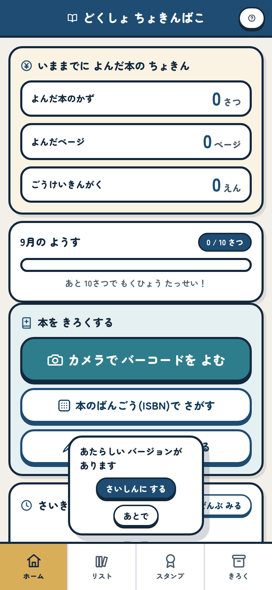

「さいしんに する」を おすと、あたらしく なります。

かんそうを かいて いる とちゅうなら、先に きろくして から「さいしんに する」を おして ください。

### インターネットに つながらない がめんが 出た

「いま インターネットに つながって いません」の がめんが 出た ときは、Wi-Fi を たしかめて「もういちど ためす」を おします。きろくは きかいの 中に のこって いるので、きえて いません。

さいしょの 1<ruby>回<rt>かい</rt></ruby>を インターネットに つながった ところで ひらいて いれば、2<ruby>回<rt>かい</rt></ruby>めからは つながって いなくても ホームは ひらけます。本の じょうほうを しらべる ことだけが できません。

### おとが ならない・うるさい

「きろく」タブの「おとを ならす」を 見て ください。右はしが「オフ」なら 音は なりません。おすと「オン」に なります。きかいの 音の 大きさが 0に なって いないかも たしかめて ください。うごきが 気に なる ときは、きかいの「<ruby>視差効果<rt>しさこうか</rt></ruby>を<ruby>減<rt>へ</rt></ruby>らす」を オンに すると、<ruby>紙<rt>かみ</rt></ruby>ふぶきが 出なく なります。

### それでも なおらない とき

まず、この アプリを おしえて くれた 先生や、学校の じょうほうの たんとうの 先生に <ruby>聞<rt>き</rt></ruby>いて ください。どの がめんで、<ruby>何<rt>なに</rt></ruby>を おして、<ruby>何<rt>なん</rt></ruby>と 出たかを つたえると、はやく わかります。

それでも わからない ときは、この ページの いちばん 下に ある <ruby>問<rt>と</rt></ruby>い<ruby>合<rt>あ</rt></ruby>わせ先に <ruby>知<rt>し</rt></ruby>らせて ください。
